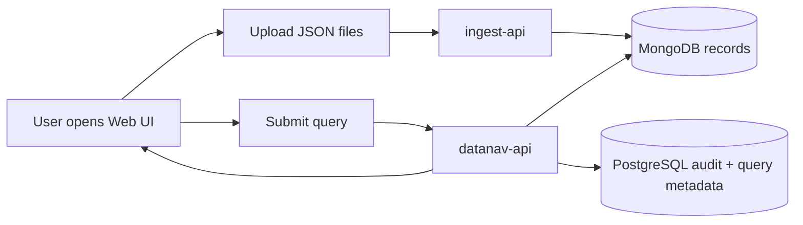

# 🧭 DataNaviGatr2

> **A local-first data ingestion, storage, query, and audit stack for survey-style datasets.**

DataNaviGatr2 is intended to run as **one deployable system** made of several smaller services. The current target deployment model is simple:

```text
Install Docker → Install Portainer → Paste docker-compose.yml into Portainer Stacks → Deploy
```

Once deployed, users open the web UI, upload JSON survey files, and query the data without needing to know where PostgreSQL, MongoDB, or the backend APIs live.

---

## ✨ What This System Does

DataNaviGatr2 is designed around a split-data model:

| Purpose | Storage |
|---|---|
| Raw/high-volume survey records | 🍃 MongoDB |
| Users, roles, query history, audit trail, saved query metadata | 🐘 PostgreSQL |

The high-level workflow looks like this:



Today, ingest is focused on **JSON files**. Over time, the intent is to support more survey formats and normalize them into a universal naming convention.

---

## 🧱 System Components

### 🌐 `gateway`

An nginx reverse proxy that gives the system a single front door.

```text
http://<server-ip>/
```

Routes:

| Path | Destination |
|---|---|
| `/` | React frontend |
| `/api/ingest/...` | ingest API |
| `/api/upload` | ingest API compatibility route |
| `/api/...` | datanav API |

This keeps users from needing to memorize ports like `5000`, `5001`, or `8080`.

---

### 🖥️ `datanavigatr2`

The React frontend Web UI.

Users can:

- open the splash/menu page
- go to ingest
- upload JSON files
- log in
- submit queries
- view saved query results
- access admin/auditing tools when their role allows it

The React app is built into a production nginx container.

---

### 📥 `ingest-api`

Backend-only ingestion service.

Responsibilities:

- accept uploaded JSON files
- validate collector and organization codes
- split JSON arrays into individual MongoDB documents
- enrich records with `_ingest` metadata
- batch-insert records into MongoDB

Primary upload endpoint:

```text
POST /api/ingest/upload
```

Health endpoint:

```text
GET /api/health
```

---

### 🧠 `datanav-api`

Main application API.

Responsibilities:

- authenticate users
- seed the default admin account
- manage roles/users/projects/folders
- translate UI queries into MongoDB queries
- query MongoDB
- save query history/results metadata into PostgreSQL
- expose auditing/admin endpoints

Health endpoint:

```text
GET /api/health
```

> ⚠️ The default admin user is intentionally seeded with the **admin role only**.

---

### 🍃 `mongodb`

Stores ingested survey records.

Default database:

```text
ingestion_db
```

Default collection:

```text
records
```

---

### 🐘 `postgres`

Stores system metadata:

- users
- roles
- projects
- folders
- saved queries
- query runs
- result snapshots/previews
- auditing state

---

## 🚀 Portainer Installation

### 1. Install Docker

Install Docker on the target machine.

### 2. Install Portainer

Portainer is expected to be available at:

```text
https://<server-ip>:9443
```

### 3. Publish or Pull Images

The compose stack expects images from GitHub Container Registry:

```text
ghcr.io/<owner>/<repo>/datanav-api:latest
ghcr.io/<owner>/<repo>/ingest-api:latest
ghcr.io/<owner>/<repo>/datanavigatr2:latest
```

These are published by:

```text
.github/workflows/docker-publish.yml
```

### 4. Create a Portainer Stack

In Portainer:

```text
Stacks → Add stack → Web editor → Paste docker-compose.yml → Deploy
```

### 5. Open the System

After deploy:

```text
http://<server-ip>/
```

Portainer remains available at:

```text
https://<server-ip>:9443
```

---

## ⚙️ Configurable Variables

These variables can be supplied in the Portainer stack environment section.

### 🏷️ Image Selection

| Variable | Default | Description |
|---|---:|---|
| `IMAGE_NAMESPACE` | `ghcr.io/your-github-username/datanavigatr2` | Container registry namespace containing the three app images |
| `IMAGE_TAG` | `latest` | Image tag to deploy |

Example:

```env
IMAGE_NAMESPACE=ghcr.io/my-github-user/datanavigatr2
IMAGE_TAG=latest
```

---

### 🔐 Database Secrets

| Variable | Default | Description |
|---|---:|---|
| `POSTGRES_PASSWORD` | `change-me-postgres` | Password for the PostgreSQL `datanav_user` account |
| `MONGO_ROOT_PASSWORD` | `change-me-mongo` | MongoDB root password |

Recommended:

```env
POSTGRES_PASSWORD=use-a-long-random-password
MONGO_ROOT_PASSWORD=use-a-different-long-random-password
```

---

### 🧑‍💼 Default Admin

| Variable | Default | Description |
|---|---:|---|
| `DEFAULT_ADMIN_USERNAME` | `admin` | Username for the seeded admin account |
| `DEFAULT_ADMIN_EMAIL` | `admin@local` | Email for the seeded admin account |
| `DEFAULT_ADMIN_PASSWORD` | `ChangeMe123!` | Password for the seeded admin account |

Example:

```env
DEFAULT_ADMIN_USERNAME=admin
DEFAULT_ADMIN_EMAIL=admin@example.local
DEFAULT_ADMIN_PASSWORD=replace-this-before-real-use
```

> 🔒 The seeded admin receives **only** the `admin` role.

---

### 🎟️ API / Auth Settings

| Variable | Default | Description |
|---|---:|---|
| `SECRET_KEY` | `change-me-secret` | Flask app secret |
| `JWT_SECRET_KEY` | `change-me-jwt` | JWT signing secret |
| `ACCESS_TOKEN_EXPIRES_MINUTES` | `15` | Access token lifetime |
| `REFRESH_TOKEN_EXPIRES_DAYS` | `7` | Refresh token lifetime |
| `COOKIE_SECURE` | `false` | Set to `true` when serving over HTTPS |
| `COOKIE_SAMESITE` | `Lax` | Refresh cookie SameSite policy |

Recommended:

```env
SECRET_KEY=generate-a-long-random-secret
JWT_SECRET_KEY=generate-another-long-random-secret
```

---

### 🌍 Gateway / Browser Access

| Variable | Default | Description |
|---|---:|---|
| `HTTP_PORT` | `80` | Host port exposed by the local nginx gateway |
| `FRONTEND_ORIGIN` | `http://localhost` | Allowed browser origin for API CORS |

Example for a LAN server:

```env
HTTP_PORT=80
FRONTEND_ORIGIN=http://192.168.1.50
```

Users would open:

```text
http://192.168.1.50/
```

---

### 📦 Ingest Settings

| Variable | Default | Description |
|---|---:|---|
| `MAX_UPLOAD_MB` | `100` | Maximum upload size accepted by ingest API |
| `INGEST_BATCH_SIZE` | `1000` | Number of records inserted per MongoDB batch |

Example:

```env
MAX_UPLOAD_MB=250
INGEST_BATCH_SIZE=2000
```

---

## 🧪 Useful Endpoints

Through the gateway:

```text
GET  http://<server-ip>/api/health
GET  http://<server-ip>/api/ingest/health
POST http://<server-ip>/api/ingest/upload
```

Internally, the containers talk on the Docker network:

| Service | Internal Port |
|---|---:|
| `datanavigatr2` | `80` |
| `datanav-api` | `5001` |
| `ingest-api` | `5000` |
| `postgres` | `5432` |
| `mongodb` | `27017` |

Only the gateway publishes a browser-facing port by default.

---

## 🗃️ Persistent Data

The stack creates Docker volumes:

| Volume | Purpose |
|---|---|
| `postgres_data` | PostgreSQL data |
| `mongo_data` | MongoDB data |

Removing containers does **not** remove these volumes.

Removing volumes deletes stored data.

---

## 🛠️ Developer Notes

### Build Frontend Locally

```bash
cd datanavigatr2
npm install
npm run build
```

### Validate Compose

```bash
docker compose config
```

### Publish Images

Push to GitHub `main`, or manually run:

```text
GitHub → Actions → Publish Docker Images → Run workflow
```

---

## 🧭 Roadmap Ideas

- Universal naming convention for survey records
- Additional ingest formats beyond JSON
- Better MongoDB indexing strategy
- PostgreSQL migrations instead of automatic table creation
- Ingestion job tracking
- Query result pagination/export
- HTTPS gateway termination
- Optional Mongo Express or admin tooling profile

---

## 🟢 Current Mental Model

```text
One machine.
One Portainer stack.
One browser URL.
Many containers.
Two databases.
Clean separation between ingest, query, UI, and audit metadata.
```

That is the shape of DataNaviGatr2.

