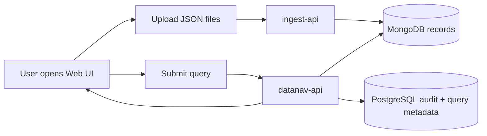

# 🧭 DataNaviGatr2

> **A local-first data ingestion, storage, query, and audit stack for survey-style datasets.**

DataNaviGatr2 is intended to run as **one deployable system** made of several smaller services. The current target deployment model is simple:

```text
Install Docker → Install Portainer → Paste docker-compose.yml into Portainer Stacks → Deploy
```

---

## ✨ What This System Does

DataNaviGatr2 is designed around a split-data model:

| Purpose | Storage |
|---|---|
| Raw/high-volume survey records | 🍃 MongoDB |
| Users, roles, query history, audit trail, saved query metadata | 🐘 PostgreSQL |

The high-level workflow looks like this:



---

## 🧱 System Components

### 🌐 `gateway`

An nginx reverse proxy that gives the system a single front door.

```text
http://<server-ip>/
```

Routes:

| Path | Destination |
|---|---|
| `/` | React frontend |
| `/api/ingest/...` | ingest API |
| `/api/upload` | ingest API compatibility route |
| `/api/...` | datanav API |

This keeps users from needing to memorize internal service ports like `5000`, `5001`, or `5002`.

---

### 🖥️ `datanavigatr2`

The React frontend Web UI.

Users can:

- open the splash/menu page
- go to ingest
- upload JSON files
- log in
- submit queries
- view saved query results
- access admin/auditing tools when their role allows it

The React app is built into a production nginx container.

---

### 📥 `ingest-api`

Backend-only ingestion service.

Responsibilities:

- accept uploaded JSON files
- validate collector and organization codes
- split JSON arrays into individual MongoDB documents
- enrich records with `_ingest` metadata
- batch-insert records into MongoDB

Primary upload endpoint:

```text
POST /api/ingest/upload
```

Health endpoint:

```text
GET /api/health
```

---

### 🧠 `datanav-api`

Main application API.

Responsibilities:

- authenticate users
- seed the default admin account
- manage roles/users/projects/folders
- translate UI queries into MongoDB queries
- query MongoDB
- save query history/results metadata into PostgreSQL
- expose auditing/admin endpoints

Health endpoint:

```text
GET /api/health
```

> ⚠️ The default admin user is intentionally seeded with the **admin role only**.

---

### 🍃 `mongodb`

Stores ingested survey records.

Default database:

```text
ingestion_db
```

Default collection:

```text
records
```

---

### 🐘 `postgres`

Stores system metadata:

- users
- roles
- projects
- folders
- saved queries
- query runs
- result snapshots/previews
- auditing state

---

# 🚀 Installation

### 1. Install Docker

Install Docker on the target machine.
```bash
sudo apt update
```
```bash
sudo apt install ca-certificates curl
```
```bash
sudo install -m 0755 -d /etc/apt/keyrings
```
```bash
sudo curl -fsSL https://download.docker.com/linux/ubuntu/gpg -o /etc/apt/keyrings/docker.asc
```
```bash
sudo chmod a+r /etc/apt/keyrings/docker.asc
```
```bash
sudo tee /etc/apt/sources.list.d/docker.sources <<EOF
Types: deb
URIs: https://download.docker.com/linux/ubuntu
Suites: $(. /etc/os-release && echo "${UBUNTU_CODENAME:-$VERSION_CODENAME}")
Components: stable
Architectures: $(dpkg --print-architecture)
Signed-By: /etc/apt/keyrings/docker.asc
EOF
```
```bash
sudo apt update
```
```bash
sudo apt install docker-ce docker-ce-cli containerd.io docker-buildx-plugin docker-compose-plugin
```

### 2. Install Portainer

Portainer is expected to be available at:
```bash
sudo docker volume create portainer_data
```
```bash
sudo docker run -d -p 8000:8000 -p 9443:9443 --name portainer --restart=always -v /var/run/docker.sock:/var/run/docker.sock -v portainer_data:/data portainer/portainer-ce:latest
```
```text
https://localhost:9443
```

### 4. Create a Portainer Stack

In Portainer:

```text
Stacks → Add stack → Web editor → Paste docker-compose.yml → Deploy
```

Once you have created the admin username for Portainer and you are logged into the Home screen, select `local` then, `Stack` then `Add stack`, give the stack a name then copy the yaml file below into the `Web editor` text area box.

### 4a. Copy/Paste Stack Script

Parameters than need to be altered in this yaml file are:
- `POSTGRES_PASSWORD`
- `MONGO_INITDB_ROOT_PASSWORD`
- `DATABASE_URL`
- `MONGO_URI` x2
- `SECRET_KEY`
- `JWT_SECRET_KEY`
- `DEFAULT_ADMIN_USERNAME`
- `DEFAULT_ADMIN_EMAIL`
- `DEFAULT_ADMIN_PASSWORD`
**NOTE** Do not remove the first tac for the passwords for example if I want to change `POSTGRES_PASSWORD: ${POSTGRES_PASSWORD:-change-me-postgres}` I would change it like so: `POSTGRES_PASSWORD: ${POSTGRES_PASSWORD:-password}`. That is how you would change the passwords for `POSTGRESS_PASSWORD`, `MONGO_INITDB_ROOT_PASSWORD`, and `DEFAULT_ADMIN_PASSWORD`. `MONGO_URI` is located in both `ingest-api` and `datanav-api` so both of those need to be altered. `MONGO_URI` and `DATABASE_URL` need to have the password changed to match the `POSTGRES_PASSWORD`, and `MONGO_INITDB_ROOT_PASSWORD`, nothing else in that needs to change unless you changed the username for those databases. Lastly the `DEFAULT_ADMIN_USERNAME`, `DEFAULT_ADMIN_EMAIL`, and `DEFAULT_ADMIN_PASSWORD` set up the login credentials for DataNaviGatr2's default admin. **DO NOT DELETE THAT USER**, if the default admin user is deleted and no other user has administrative privledges the service will have to be completely re-installed. I recommend as soon as the system is deployed login to the admin user create a new user and never touch the admin user again.

Paste this into the Portainer Stack web editor:

```yaml
services:
  postgres:
    image: postgres:16
    container_name: datanav-postgres
    restart: unless-stopped
    environment:
      POSTGRES_DB: datanav
      POSTGRES_USER: datanav_user
      POSTGRES_PASSWORD: ${POSTGRES_PASSWORD:-change-me-postgres}
    healthcheck:
      test: ["CMD-SHELL", "pg_isready -U datanav_user -d datanav"]
      interval: 10s
      timeout: 5s
      retries: 10
    volumes:
      - postgres_data:/var/lib/postgresql/data
    networks:
      - datanavigatr_net

  mongodb:
    image: mongo:7.0
    container_name: datanav-mongodb
    restart: unless-stopped
    environment:
      MONGO_INITDB_ROOT_USERNAME: admin
      MONGO_INITDB_ROOT_PASSWORD: ${MONGO_ROOT_PASSWORD:-change-me-mongo}
    healthcheck:
      test:
        [
          "CMD-SHELL",
          "mongosh --quiet -u admin -p \"$${MONGO_INITDB_ROOT_PASSWORD}\" --authenticationDatabase admin --eval 'db.adminCommand({ ping: 1 }).ok'",
        ]
      interval: 10s
      timeout: 5s
      retries: 10
    volumes:
      - mongo_data:/data/db
    networks:
      - datanavigatr_net

  ingest-api:
    image: ${IMAGE_NAMESPACE:-ghcr.io/ewsmyth/datanavigatr2}/ingest-api:${IMAGE_TAG:-latest}
    container_name: datanav-ingest-api
    restart: unless-stopped
    environment:
      MONGO_URI: mongodb://admin:${MONGO_ROOT_PASSWORD:-change-me-mongo}@mongodb:27017/ingestion_db?authSource=admin
      MONGO_DB_NAME: ingestion_db
      MONGO_COLLECTION_NAME: records
      CORS_ORIGIN: ${FRONTEND_ORIGIN:-http://localhost}
      UPLOAD_TMP_DIR: /tmp/ingest_uploads
      MAX_UPLOAD_MB: ${MAX_UPLOAD_MB:-100}
      INGEST_BATCH_SIZE: ${INGEST_BATCH_SIZE:-1000}
    depends_on:
      mongodb:
        condition: service_healthy
    networks:
      - datanavigatr_net

  datanav-api:
    image: ${IMAGE_NAMESPACE:-ghcr.io/ewsmyth/datanavigatr2}/datanav-api:${IMAGE_TAG:-latest}
    container_name: datanav-api
    restart: unless-stopped
    environment:
      DATABASE_URL: postgresql+psycopg://datanav_user:${POSTGRES_PASSWORD:-change-me-postgres}@postgres:5432/datanav
      MONGO_URI: mongodb://admin:${MONGO_ROOT_PASSWORD:-change-me-mongo}@mongodb:27017/ingestion_db?authSource=admin
      MONGO_DB_NAME: ingestion_db
      SECRET_KEY: ${SECRET_KEY:-change-me-secret}
      JWT_SECRET_KEY: ${JWT_SECRET_KEY:-change-me-jwt}
      ACCESS_TOKEN_EXPIRES_MINUTES: ${ACCESS_TOKEN_EXPIRES_MINUTES:-15}
      REFRESH_TOKEN_EXPIRES_DAYS: ${REFRESH_TOKEN_EXPIRES_DAYS:-7}
      COOKIE_SECURE: ${COOKIE_SECURE:-false}
      COOKIE_SAMESITE: ${COOKIE_SAMESITE:-Lax}
      DEFAULT_ADMIN_USERNAME: ${DEFAULT_ADMIN_USERNAME:-admin}
      DEFAULT_ADMIN_EMAIL: ${DEFAULT_ADMIN_EMAIL:-admin@local}
      DEFAULT_ADMIN_PASSWORD: ${DEFAULT_ADMIN_PASSWORD:-ChangeMe123!}
      CORS_ORIGIN: ${FRONTEND_ORIGIN:-http://localhost}
    depends_on:
      postgres:
        condition: service_healthy
      mongodb:
        condition: service_healthy
    networks:
      - datanavigatr_net

  datanavigatr2:
    image: ${IMAGE_NAMESPACE:-ghcr.io/ewsmyth/datanavigatr2}/datanavigatr2:${IMAGE_TAG:-latest}
    container_name: datanavigatr2
    restart: unless-stopped
    depends_on:
      - datanav-api
      - ingest-api
    networks:
      - datanavigatr_net

  gateway:
    image: nginx:1.27-alpine
    container_name: datanav-gateway
    restart: unless-stopped
    ports:
      - "${HTTP_PORT:-80}:80"
    command:
      - /bin/sh
      - -c
      - |
        cat > /etc/nginx/conf.d/default.conf <<'EOF'
        server {
          listen 80;
          server_name _;
          client_max_body_size 100m;

          proxy_set_header Host $$host;
          proxy_set_header X-Real-IP $$remote_addr;
          proxy_set_header X-Forwarded-For $$proxy_add_x_forwarded_for;
          proxy_set_header X-Forwarded-Proto $$scheme;

          location = /api/ingest/upload {
            proxy_pass http://ingest-api:5000/api/ingest/upload;
          }

          location /api/ingest/ {
            proxy_pass http://ingest-api:5000/api/ingest/;
          }

          location = /api/upload {
            proxy_pass http://ingest-api:5000/api/upload;
          }

          location /api/ {
            proxy_pass http://datanav-api:5001;
          }

          location / {
            proxy_pass http://datanavigatr2:5002;
          }
        }
        EOF
        nginx -g 'daemon off;'
    depends_on:
      - datanavigatr2
      - datanav-api
      - ingest-api
    networks:
      - datanavigatr_net

volumes:
  postgres_data:
  mongo_data:

networks:
  datanavigatr_net:
    driver: bridge
```

### 5. Using the System

After deploying you can open the main screen by going to your loop back or the ip of wheatever system is hosting the service:

```text
http://localhost/
```

The Mongo Express button does nothing at the time, the Portainer button takes you to your local Portainer server.
- **Inget:** This menu is where you will import your `json` files so they get filtered and sent to the queryable database. Your options in this window are:
  - Files: add one or multiple json files not exceeding 50MB
  - Collector Code: 2 character code identify the collector
  - Organization Code: 5 character code identifying your organization
  - Default GPS: This setting enables you to add a default GPS location for survey records that are missing location data.
  - Once you have filled in all the options you can upload your survey.
- **DataNaviGatr2:** This is the meat and potatoes I will list some general features of this system below:
  - Create Projects and folders to organize queries
  - Change from Dark Mode to Light Mode (If you are a psychopath)
  - Login to your account, conduct administrative and auditor tasks and logout
  - Run queries
    - Most of these query templates are junior in their design and are still going through revisions however my personal favorite is the `Custom Query Builder`; this query allows you to select a project and folder to save to, name the query, set a result limit, select start date/time and end date/time, and the best part: design the conditions in an easy human readable format.
      - Parameters (Fields) can be set to specify what type of data you want to see
      - Parameters can be AND/ORed together
      - Groups allow you to make AND/OR groups that can then be AND/ORed together
  - Once you run a query and get results returned you can open that query and more options will appear.
    - `Layouts`: allows you to customize which columns you want to see and which ones you don't as well as column order
    - `View`: Allows you to view your data in the map side of this system called GeoNaviGatr2
    - Each column header has options to allow you to sort, filer, and group data. 
    - The SARNEG feature is not fully released yet.


---

### 🔐 Database Secrets

| Variable | Default | Description |
|---|---:|---|
| `POSTGRES_PASSWORD` | `change-me-postgres` | Password for the PostgreSQL `datanav_user` account |
| `MONGO_ROOT_PASSWORD` | `change-me-mongo` | MongoDB root password |

Recommended:

```env
POSTGRES_PASSWORD=use-a-long-random-password
MONGO_ROOT_PASSWORD=use-a-different-long-random-password
```

---

### 🧑‍💼 Default Admin

| Variable | Default | Description |
|---|---:|---|
| `DEFAULT_ADMIN_USERNAME` | `admin` | Username for the seeded admin account |
| `DEFAULT_ADMIN_EMAIL` | `admin@local` | Email for the seeded admin account |
| `DEFAULT_ADMIN_PASSWORD` | `ChangeMe123!` | Password for the seeded admin account |

Example:

```env
DEFAULT_ADMIN_USERNAME=admin
DEFAULT_ADMIN_EMAIL=admin@example.local
DEFAULT_ADMIN_PASSWORD=replace-this-before-real-use
```

> 🔒 The seeded admin receives **only** the `admin` role.

---

### 🎟️ API / Auth Settings

| Variable | Default | Description |
|---|---:|---|
| `SECRET_KEY` | `change-me-secret` | Flask app secret |
| `JWT_SECRET_KEY` | `change-me-jwt` | JWT signing secret |
| `ACCESS_TOKEN_EXPIRES_MINUTES` | `15` | Access token lifetime |
| `REFRESH_TOKEN_EXPIRES_DAYS` | `7` | Refresh token lifetime |
| `COOKIE_SECURE` | `false` | Set to `true` when serving over HTTPS |
| `COOKIE_SAMESITE` | `Lax` | Refresh cookie SameSite policy |

Recommended:

```env
SECRET_KEY=generate-a-long-random-secret
JWT_SECRET_KEY=generate-another-long-random-secret
```

---

### 🌍 Gateway / Browser Access

| Variable | Default | Description |
|---|---:|---|
| `HTTP_PORT` | `80` | Host port exposed by the local nginx gateway |
| `FRONTEND_ORIGIN` | `http://localhost` | Allowed browser origin for API CORS |

Example for a LAN server:

```env
HTTP_PORT=80
FRONTEND_ORIGIN=http://192.168.1.50
```

Users would open:

```text
http://192.168.1.50/
```

---

### 📦 Ingest Settings

| Variable | Default | Description |
|---|---:|---|
| `MAX_UPLOAD_MB` | `100` | Maximum upload size accepted by ingest API |
| `INGEST_BATCH_SIZE` | `1000` | Number of records inserted per MongoDB batch |

Example:

```env
MAX_UPLOAD_MB=250
INGEST_BATCH_SIZE=2000
```

---

## 🧪 Useful Endpoints

Through the gateway:

```text
GET  http://<server-ip>/api/health
GET  http://<server-ip>/api/ingest/health
POST http://<server-ip>/api/ingest/upload
```

Internally, the containers talk on the Docker network:

| Service | Internal Port |
|---|---:|
| `ingest-api` | `5000` |
| `datanav-api` | `5001` |
| `datanavigatr2` | `5002` |
| `postgres` | `5432` |
| `mongodb` | `27017` |

Only the gateway publishes a browser-facing port by default.

---

## 🗃️ Persistent Data

The stack creates Docker volumes:

| Volume | Purpose |
|---|---|
| `postgres_data` | PostgreSQL data |
| `mongo_data` | MongoDB data |

Removing containers does **not** remove these volumes.

Removing volumes deletes stored data.
